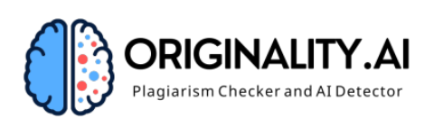
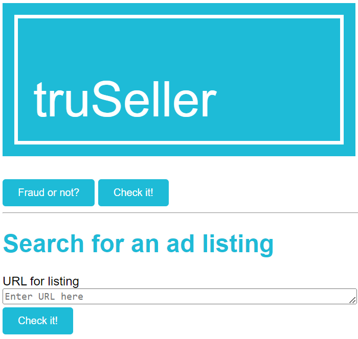

# Welcome to our submission for CraftHack 2023!


## Intro
Introducing **truSeller**: Empowering online marketplaces to combat scammers with AI and SEON's tools. **truSeller** uses advanced AI algorithms to detect suspicious profiles and protects users from potential scams. Integrated with SEON's fraud detection features, it builds holistic user profiles for evaluating trustworthiness. With a user-friendly interface and simple yet robust scoring, **truSeller** strengthens marketplace security, fostering trust between buyers and sellers. Join the fight against scammers with **truSeller** and create a safer digital marketplace ecosystem.

## Features

### 1. SEON's API


SEON's proprietary API combines the seller's email, phone number, IP, and AML APIs with device fingerprinting so that we can request and receive its enriched data, rules, and scoring in a single API call.

### 2. Originality AI model capabilities



After corpus aggregation, we call Originality AI's custom API for detection of fraud-positive text. With this, we leverage a custom pre-trained model's predictions on a new problem.


## Getting Started

The easiest way to get started is to clone the repository:

```bash
# Get the latest snapshot
git clone https://github.com/balintdecsi/crafthack23-aa.git myproject

# Change directory
cd myproject

# Install NPM dependencies
python3 -m pip install -Ur requirements.txt

# Configurate Flask variables
export FLASK_APP=app
export FLASK_ENV=development

# Start the application on localhost
flask run
```

Please reach to us for our custom API keys or set yours in the environment variables:
```bash
export seon_api_key=[YOUR-SEON-KEY]
export  originality_api_key=[YOUR-ORIG-KEY]
```

## Usage of the product

Opening our site you find the following friendly UI:



The best way to get familiar with our product is to watch our submission video:
[trueSeller submission](https://www.example.com)

## The AA-Team

Advanced Analytics, not something else. We are a diverse group of young professionals who come from different backgrounds but share a strong bond. Despite being a relatively new team, we work together smoothly. Laughter and a positive work atmosphere are integral to our team culture, fostering a supportive environment where everyone thrives. Our motto is: One pun a day keep the doctor away.
